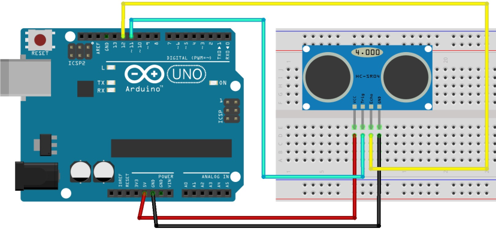
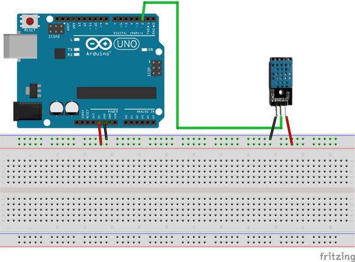
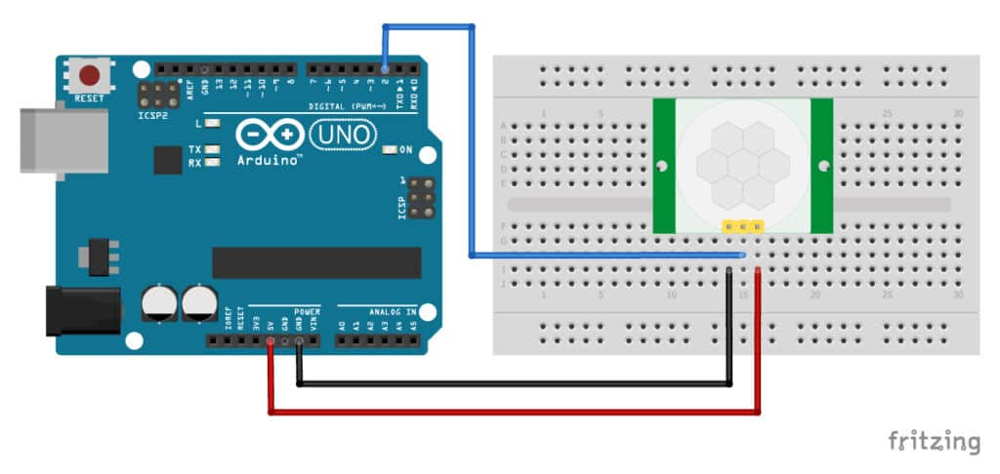

# 🎓 Taller de Automatización de Sensores con Telegram

Bienvenidos al taller de IoT y Sensores. Aquí aprenderás a usar diferentes sensores con Arduino de forma divertida y educativa.

---

## 📦 Sensores Incluidos en el Taller

### 1. 📏 HC-SR04 - Sensor Ultrasónico

**Carpeta:** `HC_SR04_UltrasonicSensor`

**¿Qué hace?**
- Mide distancias como los murciélagos (usando sonido)
- Detecta objetos de 2 cm hasta 4 metros

**Conexiones:**
```
VCC  → 5V
GND  → GND
TRIG → Pin 11
ECHO → Pin 12
```

**Diagrama de Conexión:**



**Experimentos sugeridos:**
- 🚗 Sensor de estacionamiento
- 🤖 Robot que evita obstáculos
- 📊 Medidor de altura

---
### 2. 🌡️ DHT11 - Sensor de Temperatura y Humedad

**Carpeta:** `DHT11_TemperatureHumidity`

**¿Qué hace?**
- Mide temperatura del aire (°C)
- Mide humedad del aire (%)

**Conexiones:**
```
Pin 1 (VCC)  → 5V
Pin 2 (DATA) → Pin 2
Pin 3 (GND)  → GND
```

**Diagrama de Conexión:**



**⚠️ IMPORTANTE:** Necesitas instalar librerías:
1. Abre Arduino IDE
2. Ve a: Herramientas → Administrar Bibliotecas
3. Busca e instala:
   - "DHT sensor library" de Adafruit
   - "Adafruit Unified Sensor"

**Experimentos sugeridos:**
- 🏠 Estación meteorológica
- ❄️ Control de aire acondicionado
- 🌡️ Termómetro digital

---

### 5. 👋 HC-SR501 - Sensor de Movimiento PIR

**Carpeta:** `HC_SR501_PIRMotionSensor`

**¿Qué hace?**
- Detecta personas o animales en movimiento
- "Ve" el calor que emiten los cuerpos

**Conexiones:**
```
VCC → 5V
OUT → Pin 2
GND → GND
```

**Diagrama de Conexión:**



**⚠️ IMPORTANTE:**
- Necesita calibrarse 30-60 segundos sin movimiento al iniciar
- Tiene 2 potenciómetros para ajustar:
  - **Sensibilidad:** Distancia de detección (3-7 metros)
  - **Tiempo:** Duración de la señal (5 seg - 5 min)

**Experimentos sugeridos:**
- 💡 Luz automática
- 🚨 Alarma de seguridad
- 🔢 Contador de personas


## 🚀 Cómo Empezar

### Paso 1: Abre Arduino IDE

1. Busca "Arduino" en el menú inicio
2. Abre la aplicación Arduino IDE

### Paso 2: Conectar Arduino

1. Conecta tu Arduino a la computadora con cable USB
2. En Arduino IDE, ve a: Herramientas → Placa → Arduino Uno (o tu modelo)
3. Ve a: Herramientas → Puerto → Selecciona el puerto COM de tu Arduino

### Paso 3: Abrir un Archivo

1. Abre uno de los archivos `.ino` de este taller, dependiendo del sensor que quieras te tocó
2. Lee las explicaciones en los comentarios
3. Conecta el sensor según las instrucciones

### Paso 4: Subir el Código

1. Haz clic en el botón "Verificar" (✓) para revisar errores
2. Haz clic en el botón "Subir" (→) para cargar a Arduino
3. Abre el Monitor Serial: Herramientas → Monitor Serial
4. Configura velocidad a 9600 baudios (abajo a la derecha)

### Paso 5: Experimenta

- Lee los valores que aparecen
- Prueba los experimentos sugeridos en los comentarios
- Modifica los números y ve qué pasa
- ¡Diviértete aprendiendo!

---

## 💡 Consejos para el Taller

### Para Profesores

✅ Empezar con sensores simples (HC-SR04, HC-SR501)  
✅ Dejar que los niños experimenten modificando valores  
✅ Hacer que comparen resultados entre equipos  
✅ Combinar sensores para proyectos más complejos  
✅ El sensor de cámara es solo para mostrar conceptos avanzados

### Para Estudiantes

✅ Lee todos los comentarios en el código  
✅ No tengas miedo de experimentar  
✅ Si algo no funciona, revisa las conexiones  
✅ Anota qué pasa cuando cambias valores  
✅ Trabaja en equipo y comparte descubrimientos

### Solución de Problemas

❌ **No aparecen datos:** Revisa las conexiones  
❌ **Error al compilar:** Verifica que instalaste las librerías (DHT11)  
❌ **Valores raros:** Reinicia Arduino y recarga el código  
❌ **Puerto no disponible:** Desconecta y vuelve a conectar el USB

---

## 🎯 Proyectos Finales Sugeridos

Combina varios sensores para crear:

1. **🏠 Casa Inteligente**
   - Luz automática con HC-SR501
   - Control de temperatura con DHT11
   - Alarma de lluvia con sensor de lluvia

2. **🤖 Robot Autónomo**
   - Evasión de obstáculos con HC-SR04
   - Detección de movimiento con HC-SR501

3. **🌱 Sistema de Riego Inteligente**
   - Sensor de nivel de agua
   - Sensor de lluvia
   - Sensor de temperatura

4. **📊 Estación Meteorológica**
   - DHT11 para temperatura y humedad
   - Sensor de lluvia
   - Registrar datos cada hora

---

## 📚 Recursos Adicionales

- [Arduino.cc - Tutoriales oficiales](https://www.arduino.cc/en/Tutorial/HomePage)
- [Foros de Arduino en español](https://forum.arduino.cc/c/international/spanish/12)
- [Tinkercad - Simulador online](https://www.tinkercad.com/)

---

## ⚠️ Seguridad

- Nunca conectes directamente a 220V (corriente de casa)
- Usa solo 5V de Arduino
- No mojes la placa Arduino ni las conexiones
- Pide ayuda a un adulto si no estás seguro
- Desconecta el Arduino antes de cambiar conexiones

## 🎉 Diviértete

Recuerda: **No hay preguntas tontas, solo curiosidad por aprender.**

La programación y electrónica se aprenden **haciendo y experimentando**.

**¿Cometiste un error?** ¡Perfecto! Los errores son la mejor forma de aprender.

---

**Creado con ❤️ para el Taller de IoT y Software** 🚀  
